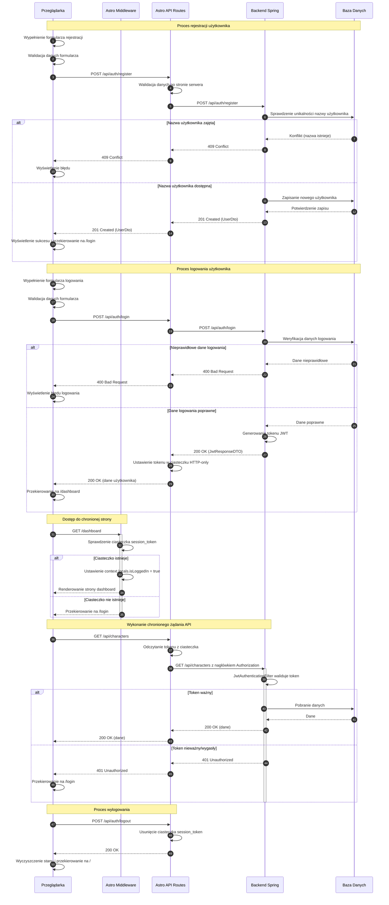

# Diagram Przepływu Autentykacji dla d-AI-logi

<authentication_analysis>
## Analiza Przepływów Autentykacji

### Zidentyfikowane przepływy autentykacji

1. **Rejestracja użytkownika**:
   - Użytkownik wypełnia formularz rejestracyjny na froncie
   - Front wykonuje walidację danych
   - Dane są przesyłane do API Gateway (Astro)
   - API Gateway przekazuje żądanie do Backendu Spring
   - Backend waliduje, tworzy użytkownika i zwraca odpowiedź
   - API Gateway przekazuje odpowiedź do frontendu
   - Użytkownik jest informowany o utworzeniu konta i przekierowywany do strony logowania

2. **Logowanie użytkownika**:
   - Użytkownik wypełnia formularz logowania
   - Front wykonuje walidację danych
   - Dane są przesyłane do API Gateway (Astro)
   - API Gateway przekazuje żądanie do Backendu Spring
   - Backend weryfikuje dane, generuje JWT token i zwraca odpowiedź z tokenem
   - API Gateway ustawia token w ciasteczku HTTP-only i zwraca odpowiedź
   - Użytkownik jest przekierowywany do strony głównej aplikacji

3. **Weryfikacja sesji i dostęp do stron chronionych**:
   - Middleware Astro sprawdza obecność tokenu w ciasteczku przy dostępie do stron chronionych
   - Jeśli token istnieje, użytkownik uzyskuje dostęp do strony
   - Jeśli token nie istnieje, użytkownik jest przekierowywany do strony logowania

4. **Dostęp do API w ramach sesji**:
   - Żądania API od zalogowanego użytkownika zawierają token z ciasteczka
   - API Gateway przekazuje token do Backendu Spring w nagłówku Authorization
   - Backend Spring weryfikuje token przy każdym żądaniu 
   - Jeśli token jest ważny, żądanie jest obsługiwane
   - Jeśli token jest nieważny, zwracany jest błąd 401

5. **Wylogowanie użytkownika**:
   - Użytkownik klika przycisk wylogowania
   - Front wysyła żądanie wylogowania do API Gateway
   - API Gateway usuwa ciasteczko z tokenem
   - Użytkownik jest przekierowywany do strony głównej

### Główni aktorzy i ich interakcje

1. **Przeglądarka (Frontend)**:
   - Renderuje interfejs użytkownika (formularze logowania/rejestracji)
   - Obsługuje walidację danych po stronie klienta
   - Wysyła żądania do API Gateway
   - Obsługuje stan sesji użytkownika po stronie klienta (przekierowania, dostęp)

2. **Astro Middleware**:
   - Przechwytuje żądania do stron chronionych
   - Weryfikuje obecność ciasteczka z tokenem
   - Udostępnia informacje o stanie logowania dla stron Astro

3. **API Gateway (Astro API Routes)**:
   - Pośredniczy między frontendem a backendem
   - Zarządza ciasteczkami sesji (ustawianie, usuwanie)
   - Przekazuje token JWT do backendu przy żądaniach API

4. **Backend Spring**:
   - Waliduje dane logowania i rejestracji
   - Generuje i weryfikuje tokeny JWT
   - Implementuje logikę biznesową chronionych zasobów
   - Zarządza bezpieczeństwem poprzez filtry i konfigurację Spring Security

### Procesy weryfikacji i odświeżania tokenów

**Weryfikacja tokenów**:
- Astro Middleware: prosta weryfikacja oparta tylko na obecności ciasteczka, bez walidacji
- Backend Spring: pełna weryfikacja tokenu JWT przy każdym żądaniu API poprzez JwtAuthenticationFilter
- Backend Spring waliduje podpis, ważność czasową i poprawność struktury tokenu

**Zarządzanie wygaśnięciem tokenu**:
- Token ma określony czas ważności ustawiony w konfiguracji backend (JwtProperties)
- Po wygaśnięciu tokenu, Backend Spring odrzuca żądania zwracając błąd 401
- Frontend musi obsłużyć ten przypadek przekierowując użytkownika do strony logowania

**Odświeżanie tokenów**:
- W obecnej implementacji brak jest automatycznego mechanizmu odświeżania tokenu
- Użytkownik musi ponownie się zalogować po wygaśnięciu tokenu

### Kroki procesu autentykacji

1. **Rejestracja**:
   - Zbieranie danych użytkownika (nazwa, hasło, potwierdzenie hasła)
   - Walidacja danych po stronie klienta
   - Przesłanie danych do Astro API
   - Przekazanie danych do Backendu Spring
   - Walidacja danych, sprawdzenie unikalności nazwy użytkownika
   - Zapisanie użytkownika w bazie danych
   - Zwrócenie potwierdzenia rejestracji

2. **Logowanie**:
   - Zbieranie danych logowania (nazwa, hasło)
   - Walidacja danych po stronie klienta
   - Przesłanie danych do Astro API
   - Przekazanie danych do Backendu Spring
   - Autentykacja użytkownika przez Spring Security
   - Generowanie tokenu JWT z czasem wygaśnięcia
   - Zwrócenie tokenu do Astro API
   - Ustawienie ciasteczka HTTP-only z tokenem
   - Przekierowanie do chronionej części aplikacji

3. **Dostęp do chronionej strony**:
   - Żądanie dostępu do chronionej strony
   - Sprawdzenie przez Middleware obecności ciasteczka z tokenem
   - Jeśli token istnieje, dostęp jest przyznawany
   - Jeśli token nie istnieje, przekierowanie do strony logowania

4. **Wykonanie chronionego żądania API**:
   - Wysłanie żądania API z chronionej strony
   - API Gateway odczytuje token z ciasteczka
   - API Gateway przekazuje token w nagłówku Authorization do Backendu Spring
   - Backend Spring waliduje token przez JwtAuthenticationFilter
   - Jeśli token jest ważny, operacja jest wykonywana
   - Jeśli token jest nieważny, zwracany jest błąd 401

5. **Wylogowanie**:
   - Kliknięcie przycisku wylogowania
   - Wysłanie żądania wylogowania do Astro API
   - Usunięcie ciasteczka z tokenem
   - Wyczyszczenie stanu po stronie klienta
   - Przekierowanie do strony publicznej
</authentication_analysis>

<mermaid_diagram>

</mermaid_diagram> 