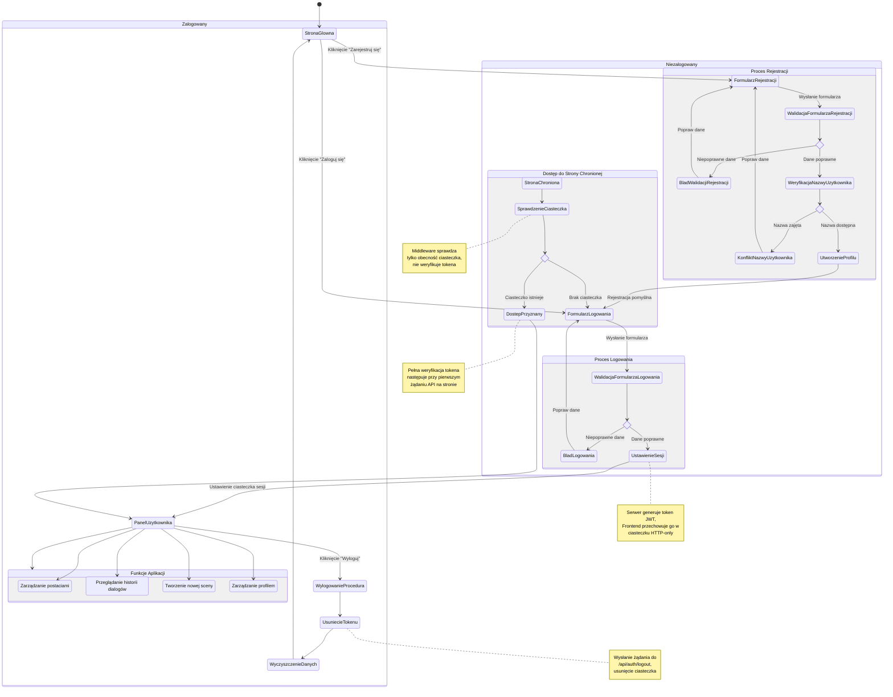

# Diagram podróży użytkownika - Logowanie i Rejestracja

<user_journey_analysis>
## Analiza podróży użytkownika dla modułu logowania i rejestracji

### 1. Zidentyfikowane ścieżki użytkownika

Na podstawie specyfikacji zidentyfikowałem następujące główne ścieżki użytkownika:

1. **Rejestracja nowego użytkownika**
   - Wejście na stronę główną jako niezalogowany użytkownik
   - Przejście do formularza rejestracji
   - Wypełnienie i wysłanie formularza rejestracji
   - Obsługa różnych wyników rejestracji (sukces, błąd walidacji, konflikt nazwy użytkownika)
   - Przekierowanie do strony logowania po sukcesie

2. **Logowanie użytkownika**
   - Wejście na stronę główną jako niezalogowany użytkownik
   - Przejście do formularza logowania
   - Wypełnienie i wysłanie formularza logowania
   - Obsługa różnych wyników logowania (sukces, błędne dane uwierzytelniające)
   - Przekierowanie do panelu głównego po sukcesie

3. **Automatyczne przekierowanie**
   - Próba dostępu do strony chronionej jako niezalogowany użytkownik
   - Przekierowanie do strony logowania
   - Powrót do żądanej strony po pomyślnym logowaniu

4. **Wylogowanie**
   - Wciśnięcie przycisku wylogowania przez zalogowanego użytkownika
   - Czyszczenie sesji i przekierowanie na stronę główną

### 2. Główne stany podróży

1. **Stan początkowy** - Niezalogowany użytkownik na stronie głównej
2. **FormularzRejestracji** - Użytkownik wypełnia formularz rejestracji
3. **FormularzLogowania** - Użytkownik wypełnia formularz logowania
4. **WeryfikacjaDanych** - System weryfikuje dane wprowadzone przez użytkownika
5. **StronaGlowna** - Użytkownik na stronie głównej po zalogowaniu
6. **StronaChroniona** - Użytkownik próbuje uzyskać dostęp do strony chronionej
7. **PanelUzytkownika** - Użytkownik zalogowany, korzystający z funkcji aplikacji

### 3. Punkty decyzyjne i alternatywne ścieżki

1. **Decyzja o akcji na stronie głównej**
   - Rejestracja nowego konta
   - Logowanie do istniejącego konta
   - Próba dostępu do strony chronionej

2. **Weryfikacja danych rejestracji**
   - Dane poprawne - utworzenie konta
   - Błąd walidacji formularza (np. hasło za krótkie)
   - Nazwa użytkownika zajęta - konflikt

3. **Weryfikacja danych logowania**
   - Dane poprawne - ustanowienie sesji
   - Dane niepoprawne - błąd logowania

4. **Próba dostępu do zasobu chronionego**
   - Użytkownik zalogowany - dostęp przyznany
   - Użytkownik niezalogowany - przekierowanie do logowania

### 4. Opis stanów

1. **StronaGlowna** - Strona powitalna, z której użytkownik może przejść do rejestracji lub logowania
2. **FormularzRejestracji** - Formularz z polami: nazwa użytkownika, hasło, potwierdzenie hasła
3. **FormularzLogowania** - Formularz z polami: nazwa użytkownika, hasło
4. **WeryfikacjaDanych** - Proces walidacji i przetwarzania danych po stronie serwera
5. **PanelUzytkownika** - Dostęp do pełnej funkcjonalności aplikacji dla zalogowanego użytkownika
6. **Wylogowanie** - Proces anulowania sesji użytkownika
</user_journey_analysis>

<mermaid_diagram>

</mermaid_diagram> 