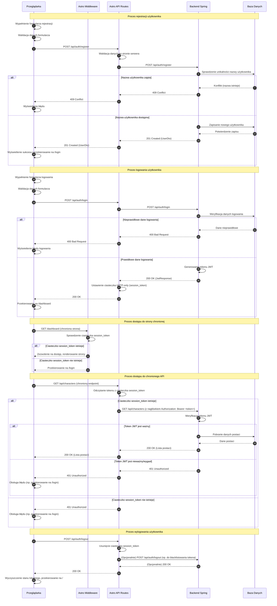

```mermaid
sequenceDiagram
    autonumber

    participant Przeglądarka
    participant Middleware as Astro Middleware
    participant API as Astro API Routes
    participant Spring as Backend Spring
    participant DB as Baza Danych

    %% Rejestracja użytkownika
    Note over Przeglądarka,DB: Proces rejestracji użytkownika
    Przeglądarka->>Przeglądarka: Wypełnienie formularza rejestracji
    Przeglądarka->>Przeglądarka: Walidacja danych formularza
    Przeglądarka->>API: POST /api/auth/register
    API->>API: Walidacja danych po stronie serwera
    API->>Spring: POST /api/auth/register
    Spring->>DB: Sprawdzenie unikalności nazwy użytkownika
    alt Nazwa użytkownika zajęta
        DB-->>Spring: Konflikt (nazwa istnieje)
        Spring-->>API: 409 Conflict
        API-->>Przeglądarka: 409 Conflict
        Przeglądarka->>Przeglądarka: Wyświetlenie błędu
    else Nazwa użytkownika dostępna
        Spring->>DB: Zapisanie nowego użytkownika
        DB-->>Spring: Potwierdzenie zapisu
        Spring-->>API: 201 Created (UserDto)
        API-->>Przeglądarka: 201 Created (UserDto)
        Przeglądarka->>Przeglądarka: Wyświetlenie sukcesu i przekierowanie na /login
    end

    %% Logowanie użytkownika
    Note over Przeglądarka,DB: Proces logowania użytkownika
    Przeglądarka->>Przeglądarka: Wypełnienie formularza logowania
    Przeglądarka->>Przeglądarka: Walidacja danych formularza
    Przeglądarka->>API: POST /api/auth/login
    API->>Spring: POST /api/auth/login
    Spring->>DB: Weryfikacja danych logowania
    alt Nieprawidłowe dane logowania
        DB-->>Spring: Dane nieprawidłowe
        Spring-->>API: 400 Bad Request
        API-->>Przeglądarka: 400 Bad Request
        Przeglądarka->>Przeglądarka: Wyświetlenie błędu logowania
    else Prawidłowe dane logowania
        Spring->>Spring: Generowanie tokenu JWT
        Spring-->>API: 200 OK (JwtResponse)
        API->>API: Ustawienie ciasteczka HTTP-only (session_token)
        API-->>Przeglądarka: 200 OK
        Przeglądarka->>Przeglądarka: Przekierowanie na /dashboard
    end

    %% Dostęp do chronionej strony
    Note over Przeglądarka,DB: Proces dostępu do strony chronionej
    Przeglądarka->>Middleware: GET /dashboard (chroniona strona)
    Middleware->>Middleware: Sprawdzenie ciasteczka session_token
    alt Ciasteczko session_token istnieje
        Middleware-->>Przeglądarka: Zezwolenie na dostęp, renderowanie strony
    else Ciasteczko session_token nie istnieje
        Middleware-->>Przeglądarka: Przekierowanie na /login
    end

    %% Dostęp do chronionego API
    Note over Przeglądarka,DB: Proces dostępu do chronionego API
    Przeglądarka->>API: GET /api/characters (chroniony endpoint)
    API->>API: Odczytanie tokenu z ciasteczka session_token
    alt Ciasteczko session_token istnieje
        API->>Spring: GET /api/characters (z nagłówkiem Authorization: Bearer <token>)
        Spring->>Spring: Weryfikacja tokenu JWT
        alt Token JWT jest ważny
            Spring->>DB: Pobranie danych postaci
            DB-->>Spring: Dane postaci
            Spring-->>API: 200 OK (Lista postaci)
            API-->>Przeglądarka: 200 OK (Lista postaci)
        else Token JWT jest nieważny/wygasł
            Spring-->>API: 401 Unauthorized
            API-->>Przeglądarka: 401 Unauthorized
            Przeglądarka->>Przeglądarka: Obsługa błędu (np. przekierowanie na /login)
        end
    else Ciasteczko session_token nie istnieje
        API-->>Przeglądarka: 401 Unauthorized
        Przeglądarka->>Przeglądarka: Obsługa błędu (np. przekierowanie na /login)
    end

    %% Wylogowanie użytkownika
    Note over Przeglądarka,DB: Proces wylogowania użytkownika
    Przeglądarka->>API: POST /api/auth/logout
    API->>API: Usunięcie ciasteczka session_token
    API->>Spring: (Opcjonalnie) POST /api/auth/logout (np. do blacklistowania tokena)
    Spring-->>API: (Opcjonalnie) 200 OK
    API-->>Przeglądarka: 200 OK
    Przeglądarka->>Przeglądarka: Wyczyszczenie stanu lokalnego, przekierowanie na /
```